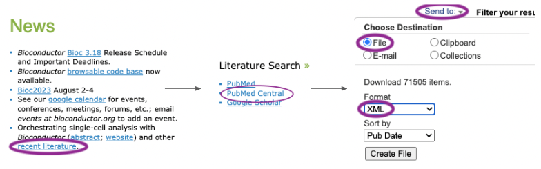

```{r, include = FALSE}
knitr::opts_chunk$set(
  collapse = TRUE,
  comment = "#>"
)
```

# Instal and load

Install the development version of [pmcbioc][] from
[GitHub](https://github.com/) with:

[pmcbioc]: https://mtmorgan.github.io/pmcbioc/

```{r, eval = FALSE}
# install.packages("devtools")
devtools::install_github("mtmorgan/pmcbioc")
```

Load the package with:

```{r setup, message = FALSE}
library(pmcbioc)
```

# Retrieve and process PubMedCentral data

[pmcbioc][] requires that the user visit the [PubMedCentral][] web
site, search for terms or citations of intersted, and chooses to save
the results to their local disk as an XML file. For the analysis in
this document, I visited the [Bioconductor][] web site, located the
[Publications][] page, followed the 'PubMed Central' link to a
[predefined search][], and saved the results as an XML file. These
steps can be automated through the NIH EUtils API, e.g., using
[renterez][].

[Bioconductor]: https://bioconductor.org
[Publications]: https://bioconductor.org/help/publications/
[predefined search]: https://www.ncbi.nlm.nih.gov/pmc/?term=bioconductor
[renterez]: https://cran.r-project.org/package=rentrez



The XML contains *full text* of all articles satisfying the query,
which means that it can be quite large; 71,259 citations to the term
'Bioconductor' retrieved on 2023-09-08 occupy about 8.5GB of disk
space. Suppose that the result file is `pmc_result.xml`, in the
current working directory.

Data processing involves four steps

1. Create a [DuckDB][] database, to be accessed using the
   [duckdb][duckdb-R] *R* package.
2. Parse article metadata (PubMedCentral id, title, journal, year,
   pmid, authors, keywords, citation PubMed ids) into tables in the
   database.
3. Index the XML file to allow fast access to the full record of
   individual articles, and record the index in the database.
4. Closing and perhaps renaming the database.

[PubMedCentral]: https://pubmed.ncbi.nlm.nih.gov/
[DuckDB]: https://duckdb.org/
[duckdb-R]: https://cran.r-project.org/package=duckdb

## Database creation

Create a new DuckDB database in the current working directory. Use a
temporary file name to avoid accidentally over-writing existing work.

```{r}
db_file <- tempfile(tmpdir = ".", fileext = ".duckdb")
db <- pmcbioc_db(db_file)
db
```

Connection to a new (empty) database allows for updates (`read_only:
FALSE`). Connecting to an existing database is by defualt read-only
(`read_only: TRUE`); an existing database can be opened to allow
updates with the `pmcbioc_db()` argument `read_only = TRUE`.

## Article metadata

Parse metadata about each article in the XML file into the database
using `xml_parse()`. The arguments are the path to the XML file, and
the database created in the previous step.

```{r, eval = FALSE}
## not evaluated
xml_parse("pmc_result.xml", db)
```

This process is expensive in both time and memory. The Bioconductor
query took about 1 minute per 1000 records, and ultimately consumed
about 18Gb of memory. Processing using `XML::xmlEventParse()`, with
'[XPath][]' queries used to extract metadata from each
article. Details of the paths used are visble using the (non-exported)
function

```{r, eval = FALSE}
## not evaluated
pmcbioc:::xml_branches(db)
```

When the process completes, the database will contain four tables

```{r, eval = FALSE}
db_tables(db)
#> [1] "article" "author"  "keyword" "refpmid"
```

[XPath]: https://www.w3.org/TR/1999/REC-xpath-19991116/

## XML index

The function `xml_index()` creates an index on the large XML file
downloaded from PubMedCentral, making it easy to query subsets of
articles for information not extracted to the database with
`xml_parse()`. Create and add the index with

```{r, eval = FALSE}
## not evaluated
xml_index("pmc_result.xml", db)
```

This process is faster and less memory-intensive than `xml_parse()`,
but still takes several minutes. On completion, the database contains
an additional table `index`.


```{r, eval = FALSE}
db_tables(db)
#> [1] "article" "author"  "index"   "keyword" "refpmid"
```

## Final steps

Remember to disconnect from the database, so any buffered data is
written to disk.

```{r}
db_disconnect(db)
```

Optionally, rename the temporary file to something permanent.

```{r, eval = FALSE}
## not evaluated
file.rename(db_file, "pmc_result.duckdb")
```

# Explore our data

Start by connecting to the database. Since the database already
exists, it opens as 'read only' so one does not have to worry about
accidentally corrupting it.

```{r}
db <- pmcbioc_db("~/a/github/pmcbioc/pmc_result.duckdb")
db
```

## Article metadata

### `article`

Use [dplyr][] functions to open and explore tables. Start with the
`article` table.

```{r article}
tbl(db, "article")
tbl(db, "article") |>
    count()
```

Each row represents a result returned by the original PubMedCentral
query. The fields are

- `id` is an internal identifier, representing the sequence of the
  article in the original XML file. It is used in conjunction with the
  `index` table.
- `pmcid` (PubMedCentral identifier), `title`, `journal`, and `pmid`
  (PubMed identifier) are self-explanatory.
- `year` is the earliest year recorded in the PubMedCentral
  record. Some articles have multiple publication dates associated
  with, e.g., electronic publication, submission to NIH, etc.

Missing values occur when the XPath used to extract the data failed to
identify relevant informaton. I believe that the content of the XML
associated with each record is partly at the discretion of the
journal.

Use the `article` table to plot citations as a function of year. Start
by loading the [ggplot2][] package

```{r, message = FALSE}
library(ggplot2)
```

Summarize the number of publications per year. Remember to `collect()`
the result so that the tibble is fully in-memory.

```{r pubs-per-year, message = FALSE}
pubs_per_year <-
    tbl(db, "article") |>
    count(year) |>
    collect()
```

Plot the relationship. One row is removed, corresponding to records
for which a year was not extracted from the XML. The final year is
incomplete, and there is a lag between publication and indexing by
PubMedCentral, so the last two points are an anomally.

<a id="pub" />

```{r pubs-per-year-plot}
ggplot(pubs_per_year) +
    aes(x = year, y = n) +
    geom_point() +
    scale_y_log10()
```

Journals with more than 100 articles mentioning Bioconductor are
summarized as (the unnamed journal corresponds to records for which
the XPath did not extract a name).

<a id="venue" />

```{r pubs-per-journal}
tbl(db, "article") |>
    count(journal, sort = TRUE) |>
    filter(n >= 100) |>
    collect() |>
    DT::datatable()
```

### `author`

The `author` table associates author surname and given names with
PubMedCentral identifiers. In some instances individual authors were
not extracted (e.g., because the journal reported the author using a
format the XPath did not capture). These entries are *not* reported as
`NA`, but are simply omitted from the table. Thus some authors do not
recieve credit for all their publications.

```{r}
tbl(db, "author")
tbl(db, "author") |>
    count()
```

The most prolific authors (or at least unique combinations of surname
and given names) are found as:

<a id="author" />

```{r}
tbl(db, "author") |>
    count(surname, givenname, sort = TRUE) |>
    head(100) |>
    collect() |>
    DT::datatable()
```

Data inconsistencies are not easily resolved, e.g., are these all me?

```{r}
tbl(db, "author") |>
    filter(surname == "Morgan", givenname %like% "Martin%") |>
    count(surname, givenname)
```

Publications of individual authors can be found by joining the author
and article tables using PubMedCentral id.

```{r}
tbl(db, "author") |>
    filter(surname == "Morgan", givenname %like% "Martin%") |>
    left_join(tbl(db, "article"), by = "pmcid") |>
    collect() |>
    mutate(
        author = paste(surname, givenname, sep = ", "),
        ## remove "\n" in one record
        title = gsub("[[:space:]]+", " ", title)
    ) |>
    select(author, year, title, journal, pmcid, pmid) |>
    DT::datatable()
```

### `keyword` and `refpmid`

The `keyword` table summarizes keywords associated with each
publication. Keywords are not standardized, e.g, `bioinformatic` and
`bioinformatics` are both used. Nonetheless, this provides some
insight into areas where Bioconductor is useful; an analysis could
associate keyword with year to model shifting areas of interest.

<a id="keyword" />

```{r keyword}
tbl(db, "keyword")
tbl(db, "keyword") |>
    count(keyword = tolower(keyword)) |>
    filter(n >= 100) |>
    arrange(desc(n)) |>
    collect() |>
    DT::datatable()
```

The `refpmid` table summarizes the PubMed identifiers of citations in
each article.

```{r refpmid}
tbl(db, "refpmid")
```

One can ask which publications mentioning 'Bioconductor' are most
cited by other publications mentioning 'Bioconductor'

<a id="refpmid" />

```{r}
## FIXME: is this correct?
tbl(db, "refpmid") |>
    count(refpmid, sort = TRUE) |>
    right_join(tbl(db, "article"), by = c(refpmid = "pmid")) |>
    arrange(desc(n)) |>
    head(100) |>
    collect() |>
    select(n_citn = "n", title, journal, year) |>
    DT::datatable()
```

[dplyr]: https://cran.r-project.org/package=dplyr
[ggplot2]: https://cran.r-project.org/package=ggplot2

## Querying individual records

The XML records are extremely rich. Individual records can be
retrieved and queried. For instance for the fifth record

```{r id-5}
tbl(db, "article") |>
    filter(id == 5)
```

we can use the `index` table to query the full XML record using XPath
to count the number references

```{r xpath}
xml_file <- "~/a/github/pmcbioc/pmc_result.xml"
tbl(db, "index") |>
    filter(id == 5) |>
    xml_xpath(
        "count(//article/back/ref-list/ref)",
        xml_file = xml_file
    )
```

The full XML of the first five records is

```{r first-five}
first_five <-
    tbl(db, "index") |>
    filter(id <= 5) |>
    xml_xpath(xml_file = xml_file)
```

These records can be queried using, e.g, XPath or the `xmlChildren()`
and `[[` of the XML package.

```{r first-five-xpath}
first_five["//article-meta//article-title"] |>
    XML::xmlValue()
```

# Final steps

Remember to disconnect from the database.

```{r}
db_disconnect(db)
```

# Session information

```{r sessionInfo}
sessionInfo()
```
